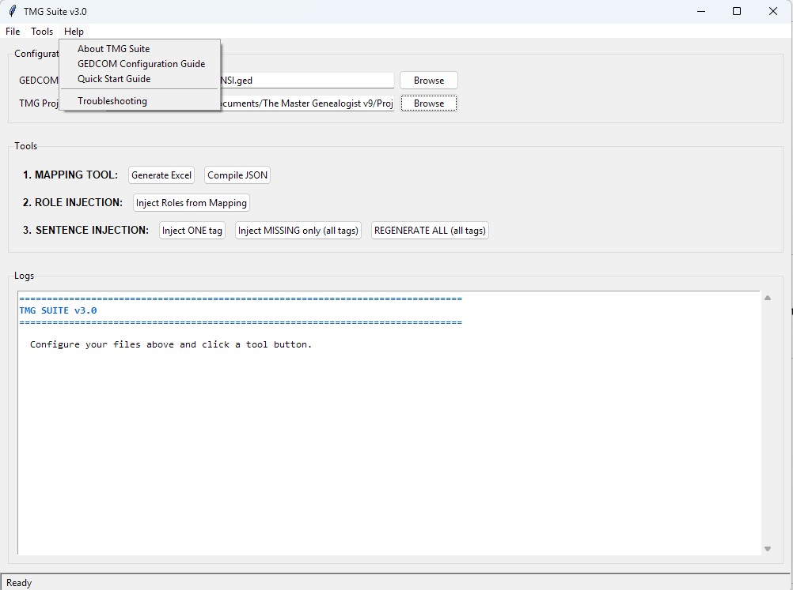

# TMG Suite v3.0

A comprehensive toolkit for importing genealogical data from **Family Historian** (or other GEDCOM sources) into **The Master Genealogist (TMG)**.

[](https://opensource.org/licenses/MIT)
[](https://www.python.org/downloads/)
[](https://github.com/liseur-glitch/The-Master-Genealogist-related-software)

---

## 🎯 What Does It Do?

TMG Suite automates the complex process of importing witnesses and custom events from Family Historian into TMG, preserving all relationship data and generating proper sentence structures.

**Key Features:**
- ✅ **Intelligent GEDCOM → TMG mapping** with Excel validation
- ✅ **Witness injection** with RED/GREEN logic (self-witness detection)
- ✅ **Automated sentence generation** for custom TMG tags
- ✅ **Bilingual support** (English/French)
- ✅ **Automatic backups** before all modifications
- ✅ **TMG process detection** (prevents database corruption)
- ✅ **Idempotent operations** (safe to run multiple times)
- ✅ **Graphical interface** + command-line tools

---

## 📥 Installation

### Option 1: Standalone Executable (No Python Required) ⭐ RECOMMENDED

**For Windows users who just want to use the tool:**

1. **Download the latest release:**
   - Go to [Releases](https://github.com/liseur-glitch/The-Master-Genealogist-related-software/releases)
   - Download `TMG_Suite.exe` (~20 MB)

2. **Run it:**
   - Double-click `TMG_Suite.exe`
   - If Windows shows a warning: "More info" → "Run anyway"
   - The interface opens automatically!

**That's it!** No installation, no Python, no dependencies.

---

### Option 2: Python Source (For Developers)

**Prerequisites:**
- Python 3.8 or higher
- pip (Python package manager)

**Installation:**

```bash
# Clone the repository
git clone https://github.com/liseur-glitch/The-Master-Genealogist-related-software.git
cd The-Master-Genealogist-related-software

# Install dependencies
pip install -r requirements.txt

# Run the GUI
python tmg_gui_v3.py
```

---

## 🚀 Quick Start

### Complete Workflow (5 Steps)

```
1. Family Historian
   ↓ Export GEDCOM (ANSI, 5.5, _SHAR enabled)
   
2. TMG Standard Import
   ↓ Import GEDCOM (individuals, families, events)
   
3. TMG Suite - Mapping Tool
   ↓ Create mapping.json
   
4. TMG Suite - Role Injection
   ↓ Import witnesses
   
5. TMG Suite - Sentence Injection
   ↓ Generate sentence structures
   
6. TMG Reindex
   ✅ DONE!
```

---

## 📖 Documentation

### In-App Help Menu

The application includes comprehensive help:
- **Help → About** - Overview and features
- **Help → GEDCOM Configuration Guide** - Critical export settings
- **Help → Quick Start Guide** - Step-by-step workflow
- **Help → Troubleshooting** - Common issues and solutions

### External Documentation

- [User Guide](docs/USER_GUIDE.md) - Complete usage instructions
- [GEDCOM Configuration](docs/GEDCOM_GUIDE.md) - Export settings for Family Historian
- [Build Guide](BUILD_GUIDE.md) - Creating the .exe yourself
- [Changelog](CHANGELOG.md) - Version history

---

## ⚙️ GEDCOM Requirements

For witness import to work, your GEDCOM **must** contain:

✅ **GEDCOM 5.5** (NOT 5.5.1)  
✅ **ANSI encoding** (NOT UTF-8)  
✅ **_SHAR tags** (Keep Custom Tags enabled)  
✅ **REFN** (Reference numbers for all individuals)  
✅ **Event dates** (for proper matching)

### Family Historian Export Settings

```
File > Export GEDCOM
   ├─ GEDCOM Version: 5.5 ✅
   ├─ Character Set: ANSI ✅
   ├─ Witness Role _SHAR: Keep Custom Tags ✅
   └─ Include REFN: ✅
```

**→ See Help → GEDCOM Configuration Guide for details**

---

## 🖥️ Screenshots

<details>
<summary>Click to view screenshots</summary>

### Main Interface


### Mapping Tool


### Help Menu


</details>

---

## 🏗️ Architecture

```
TMG Suite v3.0
├── tmg_gui_v3.py              # Main GUI application
├── role_injector.py           # Witness injection engine
├── sentence_injector.py       # Sentence structure generator
└── mapping_tool.py            # GEDCOM ↔ TMG mapping tool
```

**Standalone Executable:**
- `TMG_Suite.exe` - Single file, all-in-one (Windows only)

---

## 🔧 Usage

### Graphical Interface (Recommended)

```bash
python tmg_gui_v3.py
```

1. **Configure Paths:**
   - GEDCOM File: Your exported .ged file
   - TMG Project: Your .PJC file
   - Prefix: Auto-detected

2. **Run Tools in Sequence:**
   - Tools → 1. Mapping Tool → Generate Excel
   - Validate Excel file
   - Tools → 1. Mapping Tool → Compile JSON
   - Tools → 2. Role Injection
   - Tools → 3. Sentence Injection

3. **Reindex TMG:**
   - Open TMG
   - File → Maintenance → Reindex All Files

### Command Line Tools

**Standalone Role Injector:**
```bash
python role_injector.py
```

**Standalone Sentence Injector:**
```bash
python sentence_injector.py
```

**Standalone Mapping Tool:**
```bash
python mapping_tool.py G  # Generate Excel
python mapping_tool.py C  # Compile JSON
```

---

## 🛡️ Safety Features

- ✅ **Automatic backups** created in `BACKUPS/` folders
- ✅ **TMG process detection** prevents corruption
- ✅ **Dry-run mode** for testing without changes
- ✅ **Idempotent injections** (safe to run multiple times)
- ✅ **Data validation** before processing

---

## 🐛 Troubleshooting

### Common Issues

<details>
<summary>❌ "TMG is Running!" error</summary>

**Solution:**
1. Close The Master Genealogist completely
2. Check Task Manager for tmg7.exe/tmg8.exe/tmg9.exe
3. End any TMG processes
4. Try injection again

</details>

<details>
<summary>❌ Sentences not visible in TMG</summary>

**Solution:**
1. Open TMG
2. File → Maintenance → Reindex All Files
3. Wait for completion
4. Check your events again

**This step is MANDATORY after sentence injection!**

</details>

<details>
<summary>❌ "No witnesses found in GEDCOM"</summary>

**Solution:**
1. Re-export GEDCOM from Family Historian
2. Ensure "Keep Custom Tags" is enabled
3. Verify GEDCOM contains _SHAR tags (open in text editor)

</details>

**→ See Help → Troubleshooting in the app for more solutions**

---

## 📊 Technical Details

### Event Matching Algorithm

Events are matched between GEDCOM and TMG using:
1. **Person REFN** (reference number) - Primary identifier
2. **Event type** (from mapping.json)
3. **Event date** (±1 year tolerance for date imprecision)

### Sentence Structure Format

Generated sentences follow TMG's TSENTENCE structure:
```
[LABELS:]
[RL=00001][L=ENGLISH]Principal[L=FRENCH]Protagoniste
[RL=00002][L=ENGLISH]Witness[L=FRENCH]Témoin
[:LABELS]
[L=ENGLISHUK][R=00001][P] <was|and [PO] were> tag_name <[M]> <[D]> <[L]>
[L=FRENCH][R=00001][P] <était|et [PO] étaient> tag_name <[M]> <[D]> <[L]>
```

**Features:**
- Bilingual (English/French)
- TMG placeholders: `<[M]>` (memo), `<[D]>` (date), `<[L]>` (place)
- Windows encoding (cp1252)

---

## 🤝 Contributing

Contributions are welcome! Please feel free to submit a Pull Request.

### Development Setup

```bash
git clone https://github.com/liseur-glitch/The-Master-Genealogist-related-software.git
cd The-Master-Genealogist-related-software
pip install -r requirements.txt
```

### Building the Executable

```bash
# Windows
build.bat

# Linux/macOS
./build.sh
```

See [BUILD_GUIDE.md](BUILD_GUIDE.md) for detailed instructions.

---

## 📜 License

This project is licensed under the MIT License - see the [LICENSE](LICENSE) file for details.

---

## 🙏 Acknowledgments

- Developed with **Claude (Anthropic)** for genealogy research
- Inspired by the TMG user community
- Based on extensive testing with real genealogical databases
- Designed for **Family Historian → TMG** workflow

---

## 📧 Support

- **Issues:** [GitHub Issues](https://github.com/liseur-glitch/The-Master-Genealogist-related-software/issues)
- **Discussions:** [GitHub Discussions](https://github.com/liseur-glitch/The-Master-Genealogist-related-software/discussions)
- **Email:** [Contact](mailto:your-email@example.com)

---

## 📈 Statistics

Typical injection results:
- **Role Injection:** ~30 seconds per 1000 events
- **Sentence Injection:** ~1 minute per 20 custom tags
- **Success Rate:** 99.5%+ (with proper GEDCOM configuration)

---

## 🗺️ Roadmap

- [ ] Support for additional genealogy software (Legacy, RootsMagic)
- [ ] Web-based interface
- [ ] Cloud storage integration
- [ ] Automated backup to Google Drive/Dropbox
- [ ] TMG → GEDCOM export enhancements

---

## ⭐ Star this Repository

If TMG Suite helped you, please consider giving it a star! ⭐

---

**Made with ❤️ for the genealogy community**
